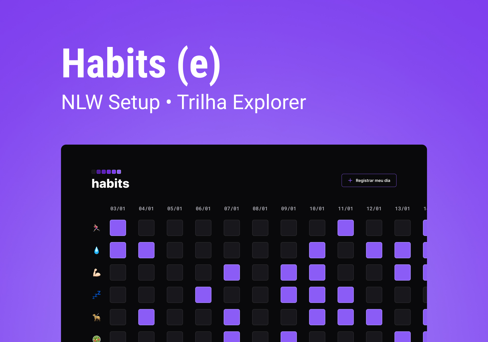

<h1 align="center"> Habits </h1>

Projeto desenvolvido no evento NLW da Rocketseat com o objetivo de desenvolver uma página que o usuário pudesse acompanhar os seus hábitos e metas dia a dia. 

  <a href="#-tecnologias">Tecnologias</a>&nbsp;&nbsp;&nbsp;|&nbsp;&nbsp;&nbsp;
  <a href="#-o-que-aprendi?">O que aprendi?</a>&nbsp;&nbsp;&nbsp;|&nbsp;&nbsp;&nbsp;
  <a href="#-projeto">Projeto</a>&nbsp;&nbsp;&nbsp;|&nbsp;&nbsp;&nbsp;
  <a href="#-layout">Layout</a>&nbsp;&nbsp;&nbsp;|&nbsp;&nbsp;&nbsp;
  <a href="#memo-licença">Licença</a>

  

  <table>
    <tr>
      <th>🚩 INICIADO</th>
      <th>✅ FINALIZADO</th>
    </tr>
    <tr>
      <td>16/01/2023</td>
      <td>21/01/2023</td>
    </tr>
  </table>

 

  

---

## 🚀 Tecnologias

Esse projeto foi desenvolvido com as seguintes tecnologias:

- HTML e CSS
- JavaScript
- Biblioteca NLWSetup
- Git e Github
- Figma

## 📘 O que aprendi?

- ✅ Salvar alterações da aplicação em Local Storage
- ✅ Convert um Objeto para um texto utilizando a função JSON.stringify()
- ✅ Converter um texto para um Objeto utilizando JSON.parse()
- ✅ Criar o arquivo .gitingore para o Git não rastrear arquivos ou pastas específicas como por exemplo o arquivo .vscode

## 🔖 Layout

Você pode visualizar o layout do projeto através [DESSE LINK](https://www.figma.com/file/Bn1sfO6ZznKlZD9I7k1VZU/Habits-e-Community). É necessário ter conta no [Figma](https://figma.com) para acessá-lo.

## :memo: Licença

Esse projeto está sob a licença MIT.
